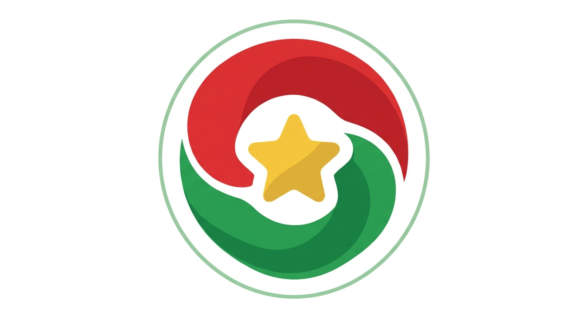

# Tigmi 

**Tigmi, en mooré (Burkina Faso), veut dire *rassembler*. C'est exactement le but de cette liste : rassembler des outils, bibliothèques et projets open source créés par ou pour le Burkina Faso, dans tous les domaines.**

**Tigmi, in Mooré (Burkina Faso), means *to gather*. That's exactly what this list is about: gathering open‑source tools, libraries, and projects created by or for Burkina Faso, across all fields.**

---

*Chaque projet listé ici est open source, publiquement accessible, et pertinent pour le contexte burkinabè ou africain. Les contributions sont ouvertes à toutes et à tous : quel que soit le niveau, le domaine ou l'origine.*

*Every project listed here is open source, publicly accessible, and relevant to the Burkinabè or African context. Contributions are open to everyone : regardless of level, domain, or background.*

---

## Table des matières / Table of Contents

- [Agriculture & Environnement / Agriculture & Environment](#agriculture--environnement--agriculture--environment)
- [Éducation / Education](#éducation--education)
- [Santé / Health](#santé--health)
- [Données & IA / Data & AI](#données--ia--data--ai)
- [Infrastructure & Systèmes / Infrastructure & Systems](#infrastructure--systèmes--infrastructure--systems)
- [Fintech & Économie / Fintech & Economy](#fintech--économie--fintech--economy)
- [Outils de développement / Developer Tools](#outils-de-développement--developer-tools)
- [Géospatial & Cartographie / Geospatial & Mapping](#géospatial--cartographie--geospatial--mapping)
- [Culture & Société / Culture & Society](#culture--société--culture--society)
- [Énergie & Eau / Energy & Water](#énergie--eau--energy--water)
- [Transports & Mobilité / Transport & Mobility](#transports--mobilité--transport--mobility)
- [Sécurité & Cybersécurité / Security & Cybersecurity](#sécurité--cybersécurité--security--cybersecurity)
- [Médias & Communication / Media & Communication](#médias--communication--media--communication)
- [**Comment contribuer / How to Contribute**](#comment-contribuer--how-to-contribute)

---

## Agriculture & Environnement / Agriculture & Environment

*Solutions numériques pour l'agriculture, l'élevage, l'eau et l'environnement.*
*Digital solutions for agriculture, livestock, water, and environment.*

| Projet / Project | Domaine / Field | Description | Langage / Language | Auteur / Author |
|---|---|---|---|---|
| *(premier projet ? [proposez le vôtre](CONTRIBUTING.md) / first project? [propose yours](CONTRIBUTING.md))* | | | | |

---

## Éducation / Education

*Plateformes, bibliothèques et ressources pédagogiques.*
*Platforms, libraries, and educational resources.*

| Projet / Project | Domaine / Field | Description | Langage / Language | Auteur / Author |
|---|---|---|---|---|
| *(premier projet ? [proposez le vôtre](CONTRIBUTING.md) / first project? [propose yours](CONTRIBUTING.md))* | | | | |

---

## Santé / Health

*Outils et bibliothèques dans le domaine de la santé publique, clinique et recherche médicale.*
*Tools and libraries in the domain of public health, clinical care, and medical research.*

| Projet / Project | Domaine / Field | Description | Langage / Language | Auteur / Author |
|---|---|---|---|---|
| [Episia](https://pypi.org/project/episia/) | Epidemiology | Bibliothèque Python d'épidémiologie et santé publique / Python epidemiology and public health library. | Python | [Xcept-Health](https://github.com/Xcept-Health) |
| [EyeTrace](https://github.com/Xcept-Health/eyetrace) | Neuroscience | Bibliothèque Python de métriques oculaires et suivi du regard / Python package for eye-tracking and ocular metrics. | Python | [Xcept-Health](https://github.com/Xcept-Health) |
| [MentalChecker](https://github.com/Xcept-Health/MentalChecker) | Mental health | Outil de dépistage et suivi en santé mentale pour le Burkina Faso./ Mental health screening and tracking tool for Burkina Faso. | TypeScript, React | [Xcept-Health](https://github.com/Xcept-Health) |
| [Wepisia](https://github.com/Xcept-Health/wepisia) | Epidemiology | Plateforme web d'épidémiologie, équivalent africain d'OpenEpi./ Web-based epidemiology platform, African equivalent of OpenEpi. | TypeScript, React | [Xcept-Health](https://github.com/Xcept-Health) |

---

## Données & IA / Data & AI

*Bibliothèques de données, machine learning, analyse statistique et IA appliquée.*
*Data libraries, machine learning, statistical analysis, and applied AI.*

| Projet / Project | Domaine / Field | Description | Langage / Language | Auteur / Author |
|---|---|---|---|---|
| [MaskMe](https://github.com/k13lucien/maskme) | Data Privacy & Compliance | Une bibliothèque Python agnostique pour le Data masking. Conçue pour transformer les données sensibles (structurées ou non) en données anonymes exploitables, garantissant ainsi le respect des règlements sur la protection des données à caractère personnel (CIL, Loi n°001-2021/AN) tout en préservant l'intégrité des flux de données. | Python | [Lucien Kiemde](https://github.com/k13lucien) |

---

## Infrastructure & Systèmes / Infrastructure & Systems

*Outils système, réseaux, sécurité, hébergement et DevOps.*
*System tools, networking, security, hosting, and DevOps.*

| Projet / Project | Domaine / Field | Description | Langage / Language | Auteur / Author |
|---|---|---|---|---|
| *(premier projet ? [proposez le vôtre](CONTRIBUTING.md) / first project? [propose yours](CONTRIBUTING.md))* | | | | |

---

## Fintech & Économie / Fintech & Economy

*Paiement mobile, microfinance, commerce, outils économiques.*
*Mobile payment, microfinance, e-commerce, economic tools.*

| Projet / Project | Domaine / Field | Description | Langage / Language | Auteur / Author |
|---|---|---|---|---|
| *(premier projet ? [proposez le vôtre](CONTRIBUTING.md) / first project? [propose yours](CONTRIBUTING.md))* | | | | |

---

## Outils de développement / Developer Tools

*CLI, frameworks, SDK, bibliothèques utilitaires.*
*CLI, frameworks, SDKs, utility libraries.*

| Projet / Project | Domaine / Field | Description | Langage / Language | Auteur / Author |
|---|---|---|---|---|
| *(premier projet ? [proposez le vôtre](CONTRIBUTING.md) / first project? [propose yours](CONTRIBUTING.md))* | | | | |

---

## Géospatial & Cartographie / Geospatial & Mapping

*SIG, cartographie, données territoriales, mobilité.*
*GIS, mapping, territorial data, mobility.*

| Projet / Project | Domaine / Field | Description | Langage / Language | Auteur / Author |
|---|---|---|---|---|
| *(premier projet ? [proposez le vôtre](CONTRIBUTING.md) / first project? [propose yours](CONTRIBUTING.md))* | | | | |

---

## Culture & Société / Culture & Society

*Langues locales, patrimoine culturel, médias, droits civiques.*
*Local languages, cultural heritage, media, civic rights.*

| Projet / Project | Domaine / Field | Description | Langage / Language | Auteur / Author |
|---|---|---|---|---|
| *(premier projet ? [proposez le vôtre](CONTRIBUTING.md) / first project? [propose yours](CONTRIBUTING.md))* | | | | |

---

## Énergie & Eau / Energy & Water

*Solutions pour l'accès à l'énergie, les énergies renouvelables, la gestion de l'eau.*
*Solutions for energy access, renewables, water management.*

| Projet / Project | Domaine / Field | Description | Langage / Language | Auteur / Author |
|---|---|---|---|---|
| *(premier projet ? [proposez le vôtre](CONTRIBUTING.md) / first project? [propose yours](CONTRIBUTING.md))* | | | | |

---

## Transports & Mobilité / Transport & Mobility

*Gestion des transports, logistique, mobilité urbaine et rurale.*
*Transport management, logistics, urban and rural mobility.*

| Projet / Project | Domaine / Field | Description | Langage / Language | Auteur / Author |
|---|---|---|---|---|
| *(premier projet ? [proposez le vôtre](CONTRIBUTING.md) / first project? [propose yours](CONTRIBUTING.md))* | | | | |

---

## Sécurité & Cybersécurité / Security & Cybersecurity

*Outils de sécurité informatique, protection des données, cyberdéfense.*
*Cybersecurity tools, data protection, cyber defense.*

| Projet / Project | Domaine / Field | Description | Langage / Language | Auteur / Author |
|---|---|---|---|---|
| *(premier projet ? [proposez le vôtre](CONTRIBUTING.md) / first project? [propose yours](CONTRIBUTING.md))* | | | | |

---

## Médias & Communication / Media & Communication

*Plateformes médiatiques, outils de communication, réseaux sociaux, radios.*
*Media platforms, communication tools, social networks, radio.*

| Projet / Project | Domaine / Field | Description | Langage / Language | Auteur / Author |
|---|---|---|---|---|
| *(premier projet ? [proposez le vôtre](CONTRIBUTING.md) / first project? [propose yours](CONTRIBUTING.md))* | | | | |

---

## Comment contribuer / How to Contribute

**Consultez [CONTRIBUTING.md](CONTRIBUTING.md) pour les détails.**  
**See [CONTRIBUTING.md](CONTRIBUTING.md) for details.**

---

## Licence / License

Ce dépôt (la liste) est sous licence [MIT](LICENSE).  
This repository (the list) is licensed under the [MIT](LICENSE) license.